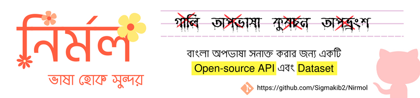

# Nirmol

**Nirmol: Keeping Bangla Online Conversations Clean and Respectful**

Nirmol is an open-source project on GitHub providing an API and resources to help developers and individuals promote clean and respectful communication in Bangla. It empowers users to detect and address abusive language, hate speech, and other forms of offensive content within Bangla text.
